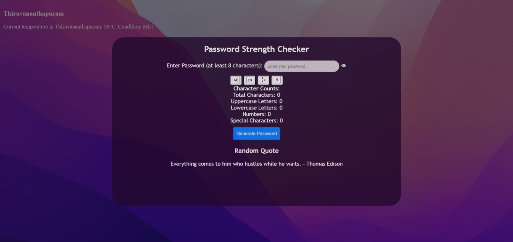
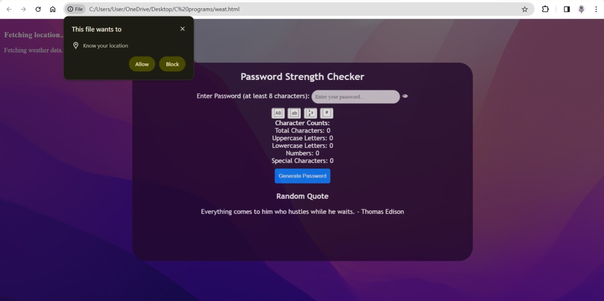

# Password Strength Checker

The provided HTML document represents a Password Strength Checker website with additional features such as password generation and weather information display. Here's a detailed description of its functionality:

The website allows users to input passwords into the designated field. As the user types, the script dynamically evaluates the password strength based on criteria such as length, presence of uppercase and lowercase letters, numbers, and special characters. The strength of the password is categorized as Weak, Medium, or Strong, and it is visually represented in the interface. The script provides feedback on the number of characters, uppercase and lowercase letters, numbers, and special characters in the password.

Users have the option to generate strong passwords using the "Generate Password" button. Generated passwords consist of a mix of uppercase letters, lowercase letters, numbers, and special characters, with a minimum length of 12 characters. The generated password is shuffled to increase randomness and security.

Visual feedback is provided through buttons that change color to indicate whether the password contains specific types of characters (uppercase, lowercase, numbers, and special characters).

The website fetches a random quote from an external API (quotable.io) each time a new password is generated. The quote is displayed in the interface for users to see.

Furthermore, the website requests permission to access the user's device location. If permission is granted, it fetches the user's current location using the Geolocation API. It then uses the latitude and longitude coordinates to fetch the current temperature and weather condition from an external weather API (weatherapi.com). The fetched weather information, including the location name, temperature, and weather condition, is displayed on the website.

Visual styling is applied using CSS to enhance readability and user experience. Visual elements such as buttons, input fields, and text are styled to provide a visually appealing and intuitive user interface.

In summary, the website provides a comprehensive tool for users to check the strength of their passwords, generate strong passwords, and access weather information based on their current location, all within a visually appealing and user-friendly interface.
## Authors

- [@BhadraR](https://www.github.com/Bhadra2005)
- [@JesseTeresaBiju](https://www.github.com/jesteresabiju)
- [@AryaPradeep](https://www.github.com/aryapradeep147)
- [@AshwiniNK](https://www.github.com/123MGHVH)


## API Reference

#### Get all items

```http
https://api.weatherapi.com/v1/current.json?key=2f4b682647214cb08c2213623240603&q=${latitude},${longitude}')
```

| Parameter | Type     | Description                |
| :-------- | :------- | :------------------------- |
| `api_key` | `string` | 2f4b682647214cb08c2213623240603 |

#### Get item

```http
  https://api.quotable.io/random

```

## Screenshots



